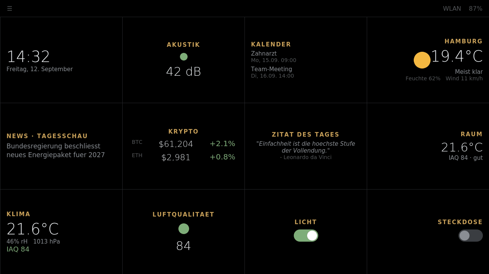
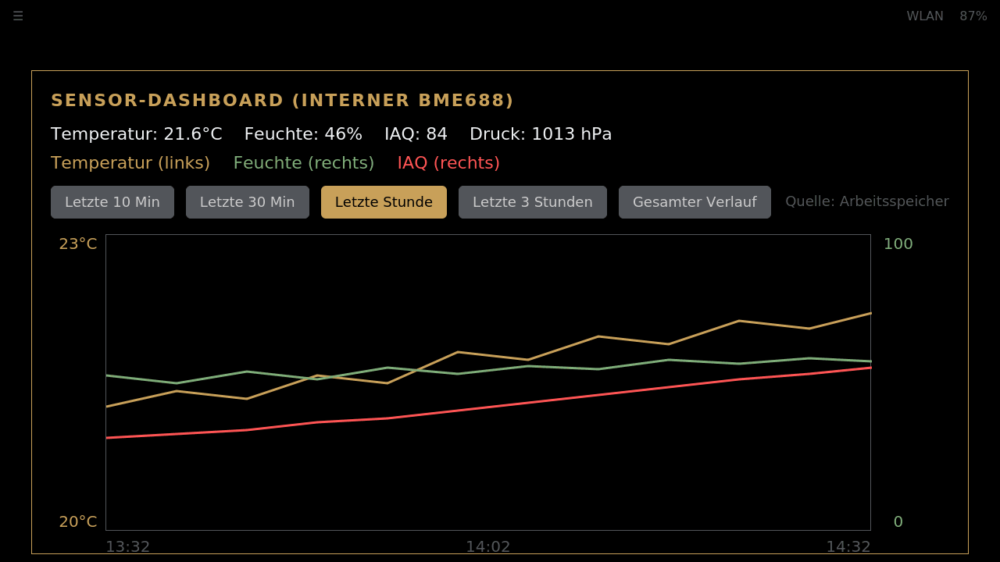
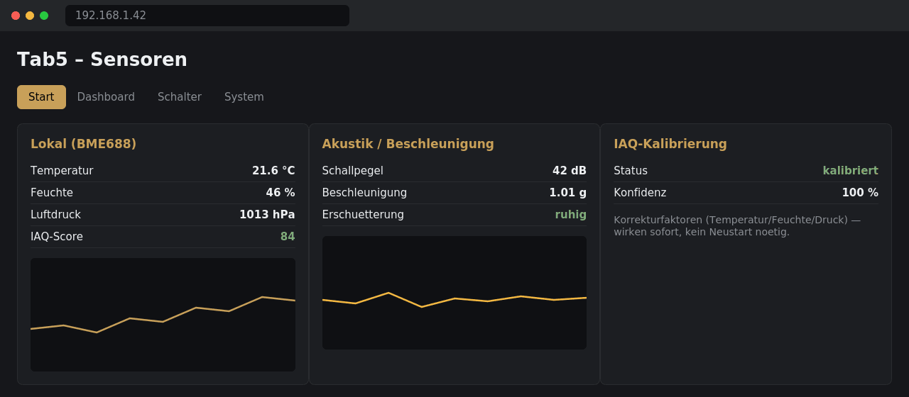

# Tab5 Magic Mirror

A MicroPython/UIFlow2 dashboard firmware for the [M5Stack Tab5](https://docs.m5stack.com/en/core/Tab5) (ESP32-P4, 1280×720 touchscreen) — a modern take on the classic "magic mirror" concept: a wall-mounted display showing weather, calendar, news, crypto, and smart-home data at a glance, plus live readings from the Tab5's own onboard sensors.



## Highlights

- **25+ configurable widgets** in a 4×3 grid — weather (with drawn icons, no image files needed), calendar, news, crypto/stocks, quotes, air-quality warnings, DEFCON status, river levels, Home Assistant switches/entities, Docker container status, and more.
- **Built-in sensor dashboard** — a second full screen with a live, multi-metric chart (temperature/humidity/IAQ) of the onboard BME688 air sensor, with selectable time ranges and automatic SD-card fallback once that becomes available.
- **Local sensors**: BME688 (temperature/humidity/pressure/IAQ with baseline calibration), BMI270 accelerometer (STA/LTA earthquake-style shock detection), onboard microphone (band equalizer + acoustic level).
- **Web UI** for configuration — no need to touch the device to rearrange widgets, connect Wi-Fi, calibrate sensors, or wire up Home Assistant/Atom relays. Changes apply live via a background reload watcher; no reboot needed for most settings.
- **Background-threaded network fetching** — network widgets update on a background thread (the ESP32-P4 has cycles to spare), so the UI clock and touch input never freeze while a widget fetches data.
- **Bilingual** (German/English), dark/light theme, all fully translatable via `i18n.py`.
- **Home Assistant** and **Atom relay board** integration for smart-switch control.

## Screenshots

| Main dashboard | Sensor dashboard | Web UI |
|---|---|---|
|  |  |  |

See [`pictures/preview_widgets.png`](pictures/preview_widgets.png) for a catalog of every individual widget.

## Hardware

- M5Stack Tab5 (ESP32-P4, 1280×720 LVGL/m5ui touchscreen, 16MB flash)
- UIFlow2 MicroPython firmware **2.4.6** specifically — see [Known limitations](#known-limitations) below for why
- Optional: M5Stack Atom relay board (light/outlet switching), Home Assistant instance, external BME688-based sensor device (e.g. a Core2-MiniDash) for a second climate reading

## Getting started

1. Flash UIFlow2 **2.4.6** onto the Tab5 (see [Known limitations](#known-limitations) — newer releases crash on boot on some chip revisions).
2. Set `boot_option` to `0` in NVS so `main.py` starts directly instead of the stock launcher:
   ```bash
   mpremote connect <PORT> resume exec "import esp32; nvs = esp32.NVS('uiflow'); nvs.set_u8('boot_option', 0); nvs.commit()"
   ```
3. Copy all project files onto the device:
   ```bash
   bash copy_to_tab5.sh <PORT>
   ```
4. Power-cycle the device. On first boot it starts a Wi-Fi access point (`Tab5-Setup`) if it can't find a known network — connect to it and open the web UI to enter your Wi-Fi credentials.
5. Open `http://<device-ip>/dashboard` in a browser to enable/arrange widgets, and `http://<device-ip>/` for live sensor readings and calibration.

See `TAB5_RUNBOOK.md` for day-to-day operational commands (flashing, recovering from a crash loop, boot troubleshooting) and `HANDOFF.md` for the full technical history of firmware quirks discovered along the way.

## Widget catalog

| Widget | Description |
|---|---|
| Clock | Local time + date, DST-aware |
| Calendar | Upcoming events from a private iCal URL |
| Weather | Current conditions with a drawn weather icon (sun/clouds/fog/rain/snow/storm), temperature, humidity, wind |
| News | Rotating RSS headlines |
| Crypto / Stocks | Rotating price ticker |
| Quote of the Day | |
| Climate (local) | Onboard BME688: temperature, humidity, pressure, IAQ score |
| Climate (external) | Same, from a second networked sensor device |
| Air Quality (local / outdoor) | IAQ traffic-light indicator; outdoor variant via Open-Meteo |
| Acoustic | Live sound level with a traffic-light indicator |
| Equalizer | Live frequency-band visualization from the onboard mic |
| Acceleration | STA/LTA ratio-based shock/earthquake indicator |
| Computer Status | CPU/GPU usage, clock, temperature from a PC on the local network (AIDA64 RemoteSensor-compatible `/sse` endpoint) |
| Docker Status | Container up/down status with colored dots, from a companion Flask service |
| Home Assistant switch / entity | Toggle lights/outlets or display any HA entity state |
| Weather warnings | Official DWD warnings for a region |
| Air quality (outdoor detail), river level, DEFCON, EWS | Assorted public-data widgets, each independently toggleable |
| Compliments, To-do | Simple static/local widgets |

Every widget can be enabled, positioned, and configured (title, refresh behavior, source URLs) from the web UI's dashboard editor — no code changes needed for day-to-day use.

## Sensor dashboard

A second screen (reachable from the burger menu) shows a live, multi-series chart of the local BME688's temperature, humidity, and IAQ score, with independent left/right axes (temperature gets its own scale; humidity and IAQ share a fixed 0–100 scale), a selectable time range (10 minutes to 24 hours), and time labels. Data currently comes from a 24-hour in-RAM ring buffer; the read path is already written to prefer the SD card transparently once that becomes available on this hardware (see below).

## Known limitations

Built and documented honestly — some of these are firmware/platform issues outside this project's control, not bugs in this code:

- **SD card does not work.** ESP32-P4 SDMMC support is an [open, unresolved issue in MicroPython itself](https://github.com/micropython/micropython/issues/18984) as of this writing, not specific to this project or firmware fork. All logging/reading code is written and ready — it will start working transparently once upstream support lands.
- **Onboard microphone returns silence** (`M5.Mic.record()` succeeds but the buffer is always zero) on the tested firmware build. Confirmed via isolated diagnostic script, reported upstream.
- **UIFlow2 releases newer than 2.4.6 crash on boot** on early ESP32-P4 engineering-sample silicon (chip revision v1.3/`eco2`). Confirmed across three releases; a support ticket is open with M5Stack. Stick to 2.4.6 on affected units.
- **BMI270 accelerometer** may return all-zero readings on some firmware builds — worth a quick sanity check on your specific unit before relying on the shock-detection widget.

None of the above block normal use of the dashboard — they simply mean the SD card, microphone-based widgets, and (on some units) the accelerometer won't show live data until upstream fixes land.

## Project structure

```
main.py                  Boot sequence, task scheduling, sensor wiring
config.py                Central config schema, defaults, migration
theme.py / i18n.py       Colors and translations (dark/light, DE/EN)
web_server.py            Web UI (dashboard editor, live sensors, settings)
fetch_worker.py          Background-thread network fetch dispatcher
widget_sources.py        All external API/data-source fetchers
burger_menu.py           On-device quick menu (Wi-Fi, brightness, screen switch)
screens/
  dashboard.py           Main dashboard screen
  widget_catalog.py       All widget build/fetch/paint logic
  sensor_history_screen.py  Live sensor chart screen
sensors/                 BME688, BMI270, microphone, SD logging/reading, IAQ tracking
widgets/                 Reusable LVGL components (cards, gauges, equalizer, ...)
tools/sim_test.py        Desktop smoke test (no hardware required)
copy_to_tab5.sh          One-shot deploy script
```

## Development

Most non-LVGL logic (config, layout math, history downsampling, i18n) can be tested on a desktop without hardware:

```bash
python3 tools/sim_test.py
```

`diagnose_*.py` scripts are standalone hardware diagnostics (microphone, battery, SD card, threading, dropdown widget behavior) used while tracking down the firmware quirks listed above — handy references if you hit similar issues on your own unit.

## Credits

Widget layout conventions and web-UI styling inspired by [oxinon/magic-mirror-3000](https://github.com/oxinon/magic-mirror-3000). Computer Status widget compatible with [oxinon/knob-esp32s3-aida-sse-server-linux](https://github.com/oxinon/knob-esp32s3-aida-sse-server-linux)'s `/sse` endpoint.

## License

MIT (or your preferred license — update this section before publishing).
